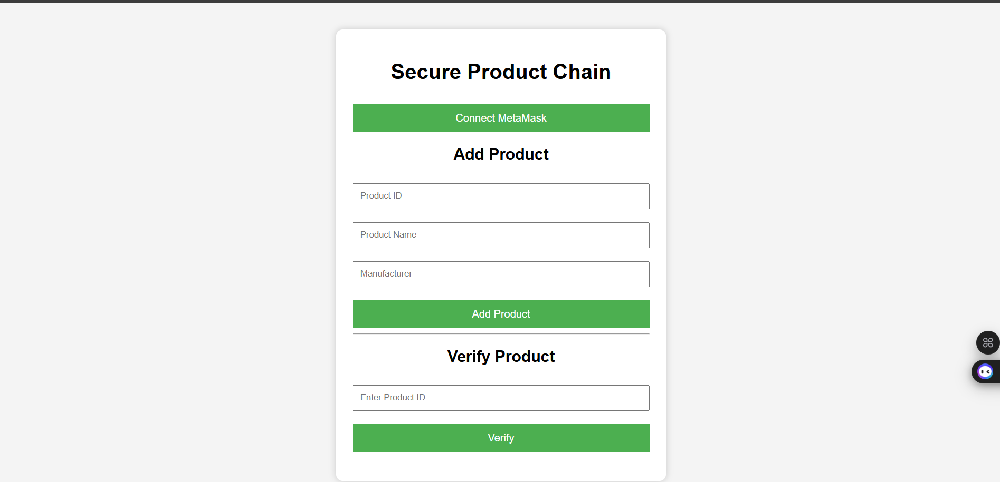
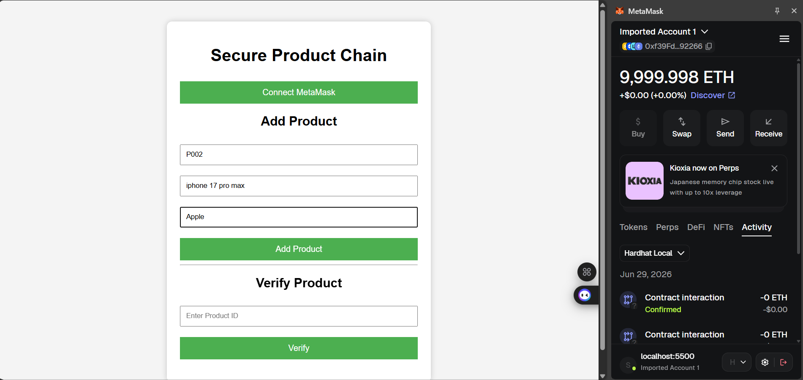
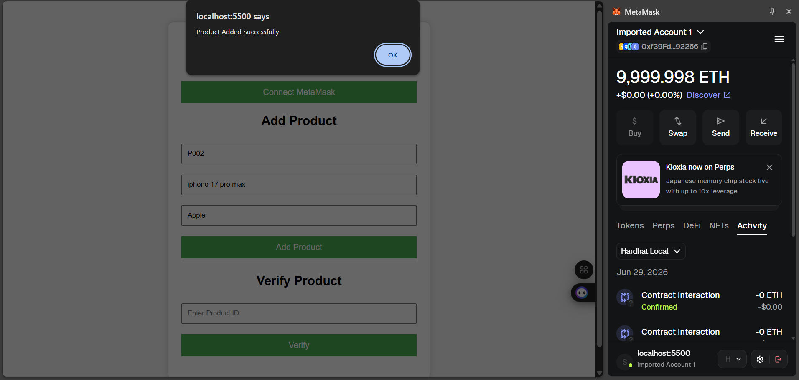
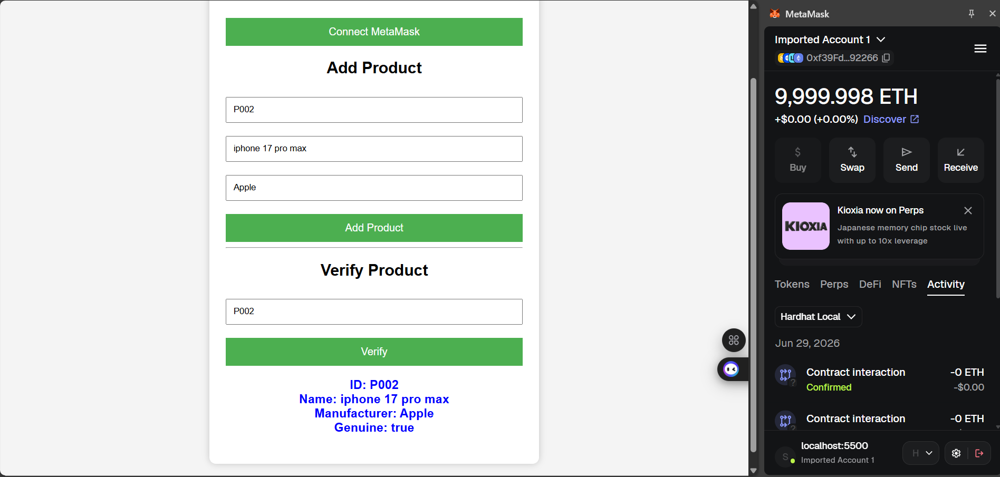

# 🔗 Secure Product Chain

A blockchain-based product verification system that helps verify the authenticity of products using Ethereum smart contracts. Manufacturers can register products on the blockchain, and users can verify product details using the Product ID.

---

## 📌 Features

- 🔐 Connects with MetaMask wallet
- 📦 Add product details to the blockchain
- ✅ Verify product authenticity
- ⛓️ Smart contract developed using Solidity
- 🌐 Frontend built using HTML, CSS, and JavaScript
- ⚡ Local Ethereum blockchain using Hardhat

---

## 🛠️ Tech Stack

- Solidity
- Hardhat
- Ethers.js
- MetaMask
- HTML5
- CSS3
- JavaScript

---

## 📂 Project Structure

```
SecureProductChain/
│
├── contracts/
│   └── ProductVerification.sol
│
├── frontend/
│   ├── index.html
│   ├── style.css
│   └── script.js
│
├── ignition/
├── artifacts/
├── package.json
└── README.md
```

---

## 🚀 Installation

### Clone the repository

```bash
git clone https://github.com/Bency-Hanita-Angelica-K/SecureProductChain.git
```

### Install dependencies

```bash
npm install
```

### Start Hardhat node

```bash
npx hardhat node
```

### Deploy the smart contract

```bash
npx hardhat ignition deploy ignition/modules/ProductVerification.js --network localhost
```

### Start the frontend

```bash
cd frontend
py -m http.server 5500
```

Open:

```
http://localhost:5500
```

---

## 📸 Working

### Add Product

- Connect MetaMask
- Enter Product ID
- Enter Product Name
- Enter Manufacturer
- Click **Add Product**

### Verify Product

- Enter Product ID
- Click **Verify**
- Product details are fetched directly from the blockchain.

---

## 📖 Smart Contract Functions

### addProduct()

Registers a new product on the blockchain.

### verifyProduct()

Returns:

- Product ID
- Product Name
- Manufacturer
- Genuine Status

---

## 🎯 Future Enhancements

- QR Code-based verification
- Product ownership transfer
- IPFS integration
- Manufacturer authentication
- Admin dashboard

---

---

## 📸 Screenshots

### 🏠 Home Page



### 🦊 MetaMask Connected


### ➕ Add Product



### 🎉 Product Added Successfully



### ✅ Product Verification



---

## 👩‍💻 Author

**Bency Hanita Angelica K**

GitHub:
https://github.com/Bency-Hanita-Angelica-K
